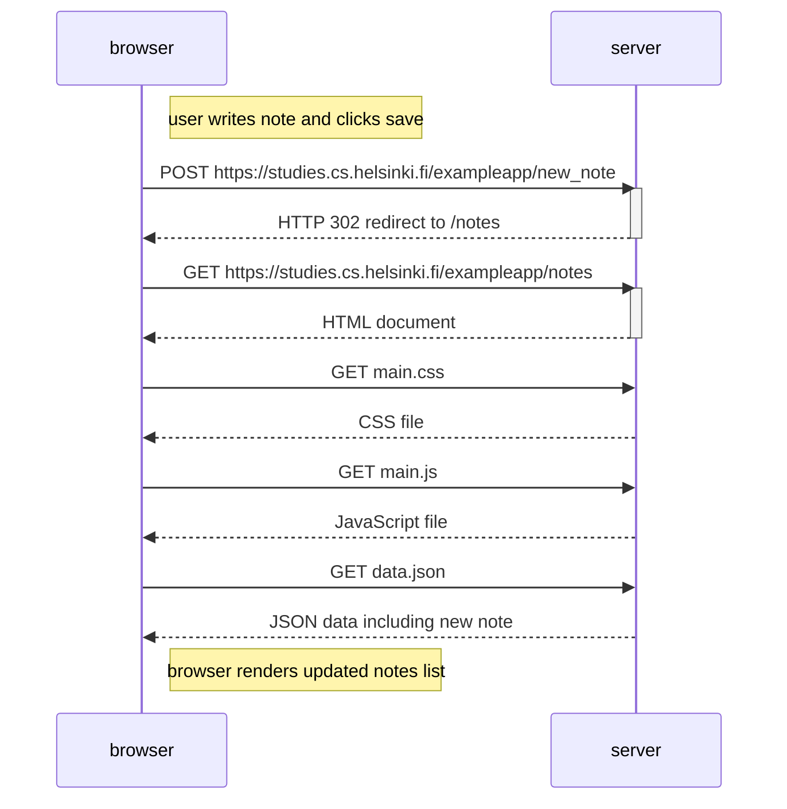

```mermaid
sequenceDiagram
    participant browser
    participant server

    Note right of browser: user writes note and clicks save

    browser->>server: POST https://studies.cs.helsinki.fi/exampleapp/new_note
    activate server
    server-->>browser: HTTP 302 redirect to /notes
    deactivate server

    browser->>server: GET https://studies.cs.helsinki.fi/exampleapp/notes
    activate server
    server-->>browser: HTML document
    deactivate server

    browser->>server: GET main.css
    server-->>browser: CSS file

    browser->>server: GET main.js
    server-->>browser: JavaScript file

    browser->>server: GET data.json
    server-->>browser: JSON data including new note

    Note right of browser: browser renders updated notes list
```