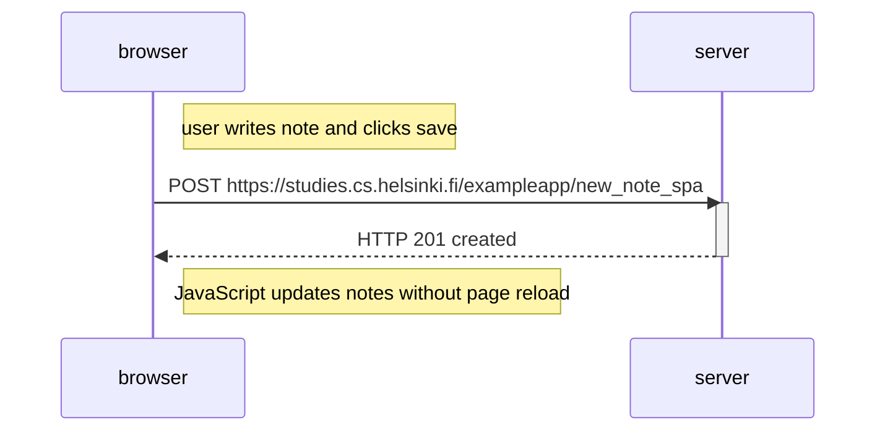

```mermaid
sequenceDiagram
    participant browser
    participant server

    Note right of browser: user writes note and clicks save

    browser->>server: POST https://studies.cs.helsinki.fi/exampleapp/new_note_spa
    activate server
    server-->>browser: HTTP 201 created
    deactivate server

    Note right of browser: JavaScript updates notes without page reload
```